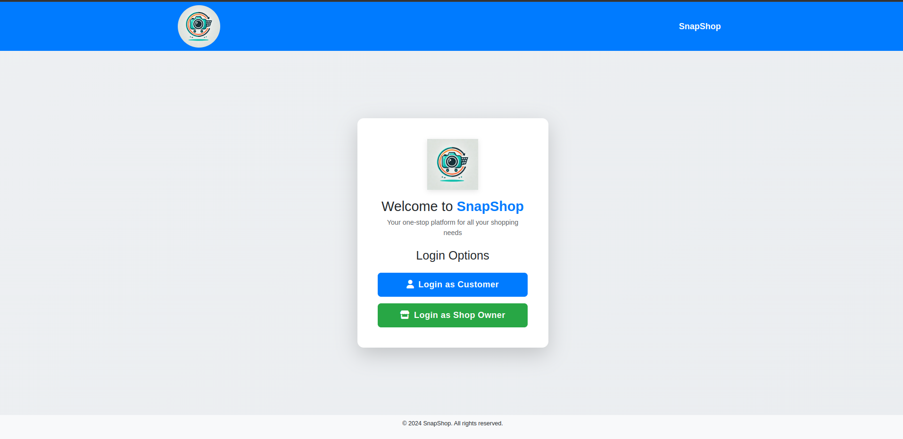
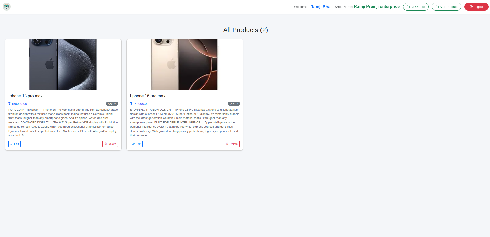
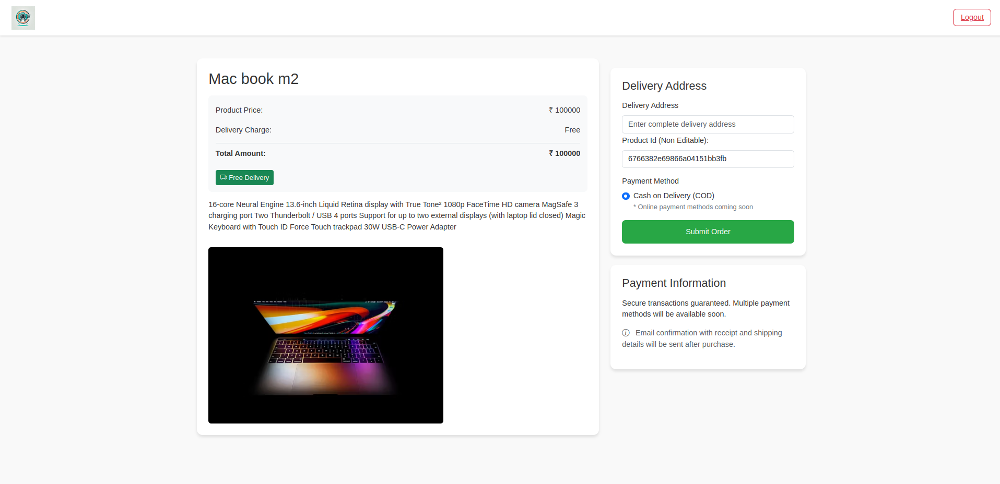
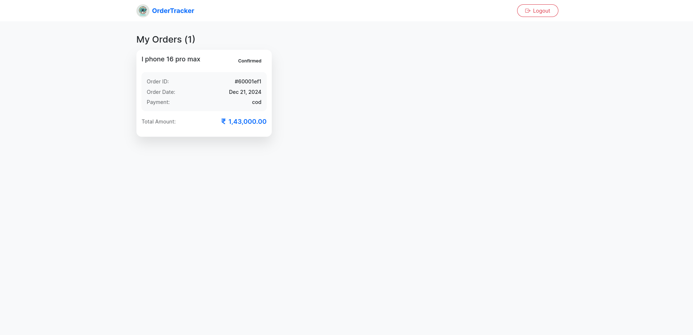
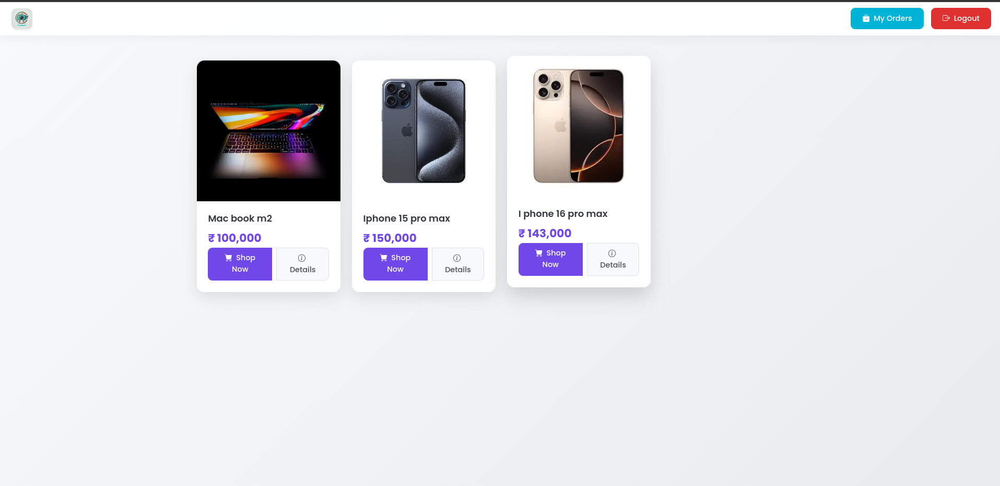

<div align="center">
  
  
  # SnapShop
  ### Your One-Stop Multi-Vendor Shopping Destination
  
  [](LICENSE)
  [](package.json)
  [](#contributing)
</div>

## 🌟 Welcome to SnapShop!

SnapShop is a cutting-edge multi-vendor e-commerce platform that brings together shoppers and sellers in a seamless digital marketplace. Whether you're looking to shop from multiple vendors or start your own online store, SnapShop provides all the tools you need for a successful e-commerce experience.

## 🎨 Platform Overview

### 🏠 Homepage

*A clean, intuitive interface showcasing featured products, popular shops, and easy navigation.*

### 📦 Owner Product Management

*Comprehensive dashboard for shop owners to manage their product inventory.*

### 🏪 Shop Product Display

*Beautiful product layouts with filtering and sorting capabilities.*

### 📊 Order Tracking

*Real-time order status updates and tracking information.*

### 🛍️ Product List

*User Product List*

### 📱 Product Details

*Detailed product views with rich information and buying options.*

## ✨ Key Features

- 🔐 Secure dual-role authentication system
- 🏪 Easy shop setup and management
- 📱 Responsive design for all devices
- 🛒 Intuitive shopping cart experience
- 📊 Comprehensive order tracking
- 💳 Secure payment processing
- 📨 Real-time notifications

## 🚀 Quick Start

1. **Clone the repository**
```bash
git clone https://github.com/yourusername/SnapShop.git
```

2. **Install dependencies**
```bash
cd dukan
npm install
```

3. **Start the application**
```bash
npm run dev
```

Visit `http://localhost:3000` to see the application in action!

## 📚 Documentation

For detailed documentation about the platform's features, API endpoints, and development guidelines, please see our [Documentation README](docs/README.md).

## 🤝 Contributing

We love contributions! Please see our [Contributing Guide](CONTRIBUTING.md) for details on how to get started.

## 📄 License

This project is licensed under the MIT License - see the [LICENSE](LICENSE) file for details.

## 💌 Contact Us

- Website: [https://snapshop.com](https://dukan-radt.onrender.com/)
- Github: [Contrbute_Here](https://github.com/Vegadjay/Dukan)
- Linkdin: [@JAYVEGAD](www.linkedin.com/in/vegadjay)
---
<div align="center">
  Made with ❤️ by the SnapShop Team
</div>
